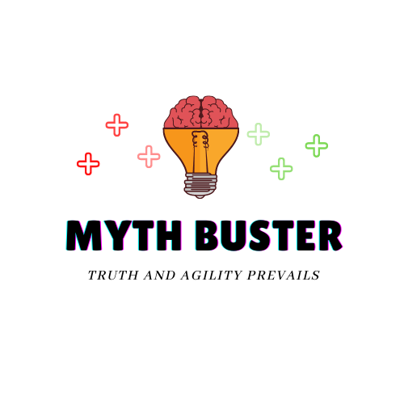
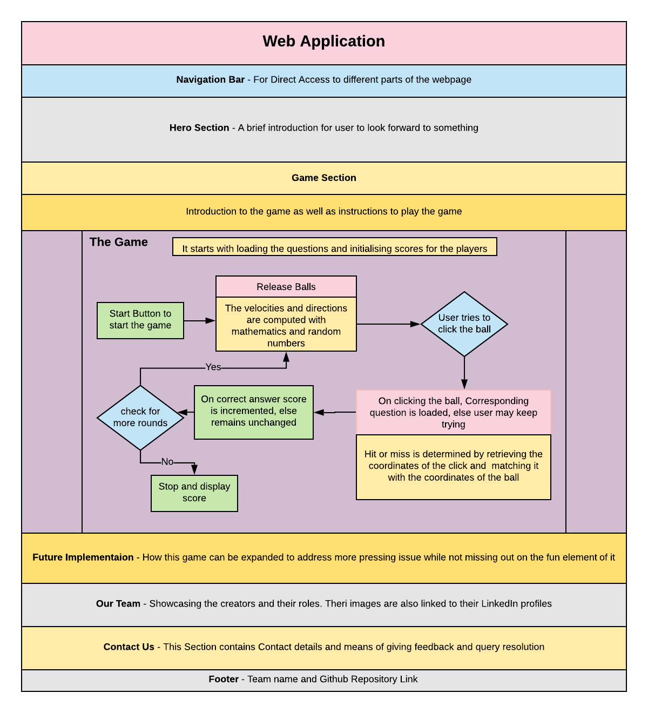

# MythBuster - Combatting prevalent myths with fun!

## Overview and Social Impact
Myth Buster is our game which encourages you and teaches you about the different myths prevalent in the society we live in, making us more socially aware while enjoting a fun and healthy game of agility! In these trying times of Covid-19, we've learnt to value the virtual interactions as well, this is a two-player game that we're willing to extend to multiple players in the future, so that you and your pals can have fun together! This togetherness, can also potentially open a dialogue about these prevalent myths in rather comfortable manner, by virtue of sportsmanship!

## System Design Implementation

Our project primarily consists of a game, and a website to showcase the game, you may observe the system design as follows wherein the box is the website and various sections of the same have been defined. The logical flow of the game has been defined in the game section.

Herein the flow of the game, with the user's perspective in greater detail appears as follows:

## Installation Steps
Replicating our game is fairly easy. To use this as it is:
* Fork this Repository
* Clone your fork
* Visit the `index.html` in your local browser to access the webpage.

If you want to add your own set of myths and facts, navigate to `/MBP5.js/public/assets/slides/` and upload images of questions and answers in sequence. Make sure you name the same with numeric digits (Eg. 1-20 as done here).

To host your own version using Github Pages, just like we did:
* Navigate to Settings Section of your GitHub Repository
* Scroll down to the section called GitHub Pages.
* Select the branch i.e. to be hosted (`main` in our case) and save.

## Challenges
A smooth sea never made a skilled sailor! We're glad to acknowledge our learnings through the process.

* Choosing the platform to build the game took a good while, as we were adamant about integrating it in a web application for easy access. We started of with *Unity* but had to make a shift to *p5.js* due to its simplicity as well as our team dynamic. This shift did cost us some valuable time which made the project completion in the deadline more challenging!
* It was our first time integrating a game into a web application and so did run into a few unpredictable situations!
* Involving multiple players in one game over the server we were working on turned out to be a little hard to understand situation. Testing the same when we both are "virtually" next to each other is yet another challenge, hampering reliability to some extent.
* We ran into some browser specific issues while trying to run our webpage locally, especially while rendering the game as some browsers do not loading of local resource (`Not allowed to load local resource`).
* The objects that are visually big in size, might be treated as point objects for mouse clicks in `p5.js`, decreasing the playability of the game.

### Techstack
* HTML
* CSS
* Javascript

### Libraries and Dependencies
* p5.js
* node.js
* Bootstrap

### Tools
* Processing Editor
* VS Code
* Git and Github
* Canva

## Screenshots

#### Contributors
[Shreyash Royzada](https://github.com/ShreyashRoyzada) spearheaded the game creation and ideation, while [Priyanshi Sharma](https://github.com/priyanshisharma) aided the ideation process and curated the website. Other logistics were mutually taken care of.

#### Declaration of Previous Work
All the work of this project has been done in the duration of the Hackathon.
